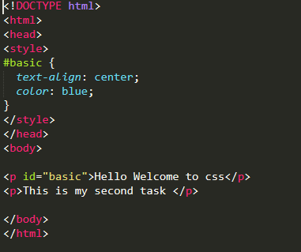

# css-documentation

## Table of Contents:
  * Selectors In CSS
  * Kinds of css
  * CSS Properties And  Values
  
## Selector:
  * Selectors are the names given to styles in internal and external style sheets
  * Syntax: 
	    Selector { property: value }
  * For each selector there are “properties” inside curly brackets, which simply take the form of words such as color, font-weight or background-color.
  * A value is given to the property following a colon (NOT an “equals” sign). Semi-colons are used to separate the properties
  * Example:
  
  
  
## Types Of Selectors:
  * Class Selector
  * Id Selector(Identifier)
  * Universal Selector
  * Descendant Selector
  * Child Combine Selector
  
## Class selector:
  * In the CSS, a class selector is a name preceded by a full stop (“.”)
  * To select elements with specific class followed by the class name
  * a class selector can be used to identify more than one element.
  
## Example:
  

## Id selector:
  * In CSS an ID selector is a name preceded by a hash character (“#”). 
  * an ID selector  can be used to identify one element
  
## Example:

## Universal Selector:
  * The universal selector (*) selects all HTML elements on the page.
  * we will define style tag in header part which will provide access to complete body.
  
## Example:
  

## Descendant  Selector:
  * we can apply style to all the childen tags present in the parent class by using space
  
## Example:

## Child Combine Selector
  * We can use styles to a specific children present in the parent by using
    “ > ”  symbol.
    
## Example:
 
 
 
 ## Kinds of CSS:
  * inline
  * internal or embeded
  * external
  
## inline:
  * Inline CSS contains the CSS property in the body section attached with element is known as inline CSS. 
  * This kind of style is specified within an HTML tag using style attribute.
  
Example:

## internal or embeded:
  * This can be used when a single HTML document must be styled uniquely. 
  * The CSS rule set should be within the HTML file in the head section i.e the CSS is embedded within the HTML file.
  
## Example:

## External:
  * External CSS contains separate CSS file which contains only style property with the help of tag attributes (For example class, id, heading, … etc).

## Example:

## Properties And Values:
  * Background: it is used to change the background color of a particular element
        ex: background-color:blue;
  * width: it is used to set the width of a element.
        ex: width: 34%
  * color: it is used to change the color of a particular element
        ex: color:navy;
  * font-size: it is used to set the font size of a element.
        ex: font-size: 40px;

